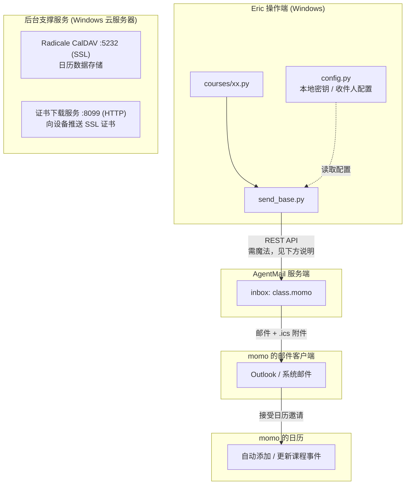
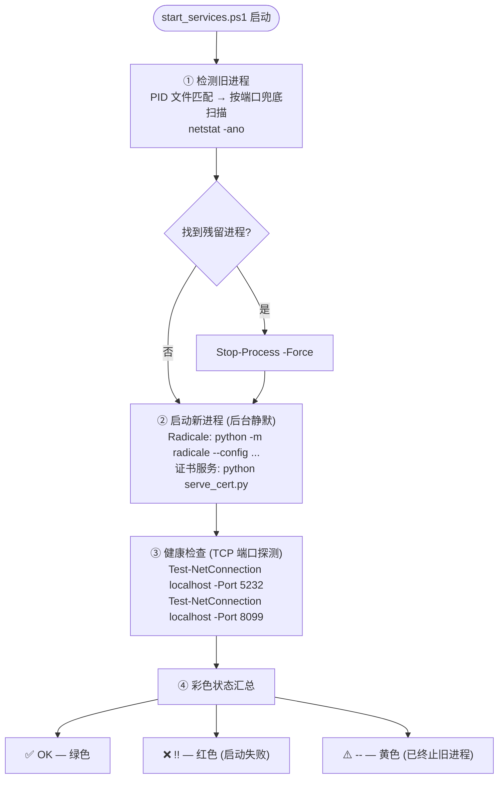
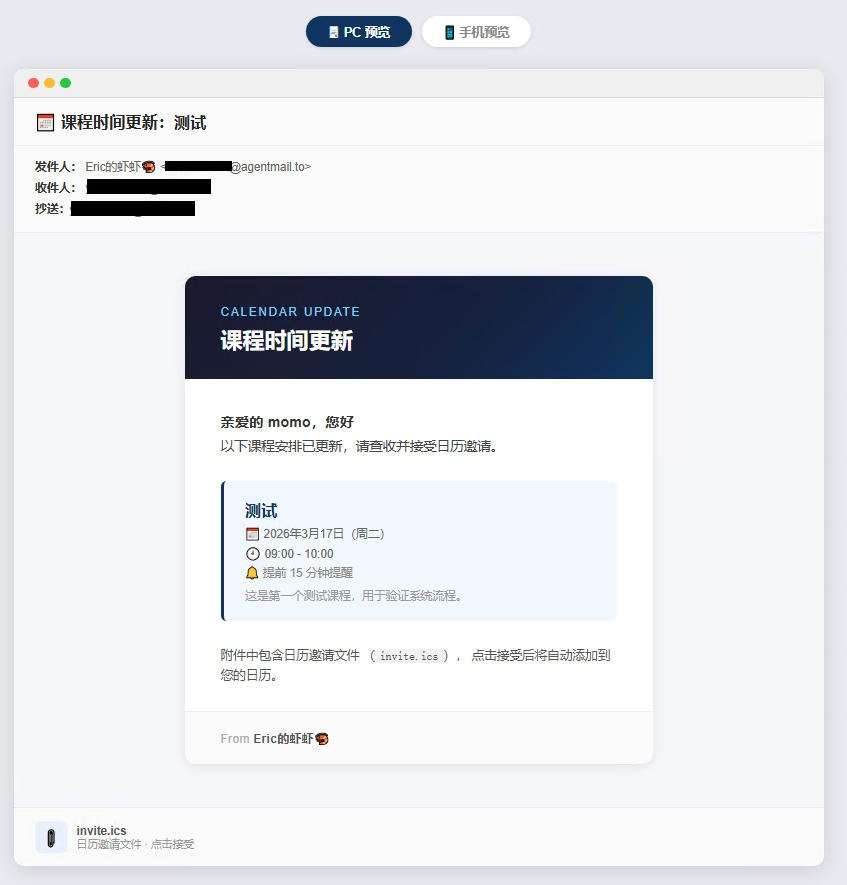
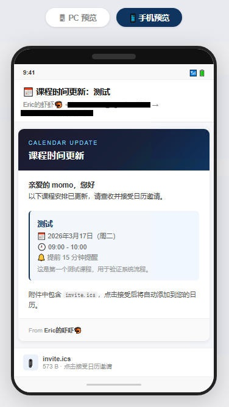
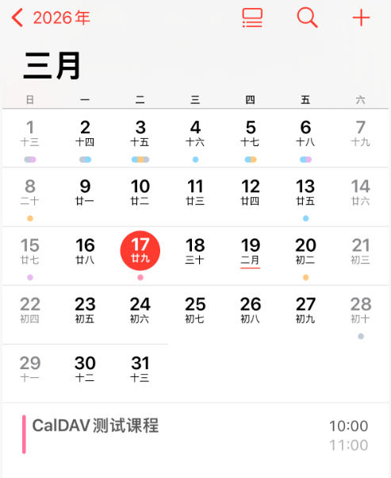

# class.momo

> 由 **Eric's Claw** 驱动的课程日历管理工具。
> 通过 [AgentMail](https://agentmail.to) 发送标准 iCalendar 邀请，支持 Outlook、iPhone、华为等所有主流日历客户端。

---

## 目录

- [设计思路](#设计思路)
- [系统架构](#系统架构)
- [项目结构](#项目结构)
- [部署指南](#部署指南)
- [启动服务](#启动服务)
- [用户配置](#用户配置)
- [发送课程提醒](#发送课程提醒)
- [更新已有课程](#更新已有课程)
- [依赖](#依赖)

---

## 设计思路

传统课程提醒依赖人工转发或手动添加，更新麻烦且容易遗漏。本项目目标：

- 每门课程对应一个独立的 `.py` 文件，信息高度集中
- 需要更新某节课时，只修改那个文件的几个字段，然后运行它
- 收件人收到一封 HTML 格式邮件，附带标准 `.ics` 日历文件
- 支持日历事件**原地更新**（不新建重复事件），依赖 iCalendar 的 `UID + SEQUENCE` 机制
- 收件人无需安装任何 App，用 Outlook / 163 / 系统邮件接受邀请即可

---

## 系统架构



**关键机制 — UID + SEQUENCE**

| 字段 | 说明 |
|------|------|
| `UID` | 每门课程全局唯一，格式 `claw-course-<名称>@ericsclaw.to`，**永远不变** |
| `SEQUENCE` | 整数，每次更新 +1，日历客户端据此判断是否覆盖旧事件 |

---

## 项目结构

```
class.momo/
├── config.py              ← 本地配置（含 API Key，已加入 .gitignore，不上传）
├── config.example.py      ← 配置模板，复制后重命名为 config.py
├── send_base.py           ← 公共发送逻辑（所有课程共用）
├── start_services.ps1     ← 一键启动所有后台服务（含 kill 旧进程 + 健康检查）
├── preview.html           ← 邮件 HTML 预览（静态，用于肉眼核对样式）
├── preview_dual.html      ← 双端预览（PC/手机切换）
├── preview_gen.py         ← 从课程文件生成预览 HTML 的脚本
├── preview.ps1            ← 快速生成预览的 PowerShell 封装
├── run.ps1                ← 快速发送测试课程的 PowerShell 封装
├── courses/
│   ├── 00ceshi.py         ← 测试课程
│   └── ...                ← 按需添加，命名规范见下
├── docs/
│   └── screenshots/       ← 邮件效果截图（PC + 手机）
└── README.md
```

**课程文件命名规范**：`两位数字 + 拼音`，例如 `01shuxue`、`02yingyu`，便于排序和识别。

---

## 部署指南

### 环境要求

| 组件 | 版本 |
|------|------|
| Python | 3.8+ |
| Radicale | 3.x |
| Windows | 服务器版或桌面版均可 |

### 1. 克隆仓库

```bash
git clone https://github.com/fei7yang/class.momo.git
cd class.momo
```

### 2. 安装 Python 依赖

```bash
pip install agentmail
pip install radicale bcrypt   # Radicale CalDAV 服务
```

### 3. 申请 AgentMail

> ⚠️ **注意：AgentMail 屏蔽国内 IP**，注册及 API 调用均需通过代理（魔法）访问。

1. 挂上代理，访问 [console.agentmail.to](https://console.agentmail.to) 注册账号
2. 创建一个 inbox，inbox ID 即为发件地址前缀（如 `class.momo` → `class.momo@agentmail.to`）
3. 在控制台生成 API Key（格式 `am_us_xxxxxxxx...`）
4. 将 API Key 和 inbox ID 填入 `config.py`（详见[用户配置](#用户配置)）

> 💡 API 调用同样需要代理。如果运行环境无代理，需在服务器上配置全局或进程级代理。

### 4. 配置 Radicale（CalDAV 服务）

Radicale 配置文件默认路径：`C:\apps\radicale\config\config`

```ini
[server]
hosts = 0.0.0.0:5232
ssl = True
certificate = C:/apps/radicale/config/server.crt
key = C:/apps/radicale/config/server.key

[auth]
type = htpasswd
htpasswd_filename = C:/apps/radicale/config/htpasswd
htpasswd_encryption = bcrypt

[storage]
filesystem_folder = C:/apps/radicale/data

[logging]
level = info
```

生成自签名证书：

```powershell
# 在 C:\apps\radicale\config\ 下执行
openssl req -x509 -newkey rsa:4096 -keyout server.key -out server.crt -days 3650 -nodes -subj "/CN=claw-caldav"
```

创建 Radicale 用户（htpasswd）：

```bash
python -c "import bcrypt; print('username:' + bcrypt.hashpw(b'password', bcrypt.gensalt(rounds=12)).decode())" >> C:\apps\radicale\config\htpasswd
```

### 5. 证书下载服务

证书服务脚本位于 `C:\temp\serve_cert.py`（未纳入 repo），通过 HTTP 8099 端口让移动设备下载并安装自签名证书，使 CalDAV 连接信任该证书。

---

## 启动服务

项目根目录下的 `start_services.ps1` 是一键启动脚本，集成了两个后台服务的完整生命周期管理：

```powershell
pwsh -File C:\Eric_Workspace\class.momo\start_services.ps1
```

**脚本工作流程：**



**预期输出：**

```
=======================================================
  Radicale CalDAV — port 5232
=======================================================
  [--]  Kill 旧 Radicale PID=3540
  [--]  启动 Radicale...
  [OK]  Radicale 运行中  PID=1640  port=5232  ✓

=======================================================
  证书下载服务 — port 8099
=======================================================
  [--]  Kill 旧 serve_cert PID=2764
  [--]  启动证书服务...
  [OK]  证书服务运行中  PID=7112  port=8099  ✓
  [--]  下载地址：http://<服务器IP>:8099/cert.crt

=======================================================
  服务状态汇总
=======================================================
  [OK]  Radicale  5232  UP
  [OK]  Cert      8099  UP

  所有服务启动完毕 ✓
```

**服务日志位置：**

| 服务 | stdout | stderr |
|------|--------|--------|
| Radicale | `C:\apps\radicale\radicale.log` | `C:\apps\radicale\radicale.log.err` |
| 证书服务 | `C:\temp\serve_cert_out.txt` | `C:\temp\serve_cert_err.txt` |

**手动单独启动（备用）：**

```powershell
# Radicale
& "C:\Program Files\Python312\python.exe" -m radicale --config "C:\apps\radicale\config\config"

# 证书服务
& "C:\Program Files\Python312\python.exe" C:\temp\serve_cert.py
```

---

## 用户配置

复制配置模板：

```bash
cp config.example.py config.py
```

编辑 `config.py`：

```python
# AgentMail API Key（在 console.agentmail.to 获取，需代理）
AGENTMAIL_API_KEY = "am_us_xxxxxxxxxxxxxxxxxxxxxxxxxxxxxxxx"

# AgentMail 发件箱 ID（你创建的 inbox，不含 @agentmail.to）
INBOX_ID = "class.momo"

# 发件人显示名
SENDER_NAME = "Eric的虾虾🦐"

# 默认收件人列表（可在各课程文件中覆盖）
DEFAULT_RECIPIENTS = [
    "momo@163.com",
]

# 提前提醒分钟数
DEFAULT_ALARM_MINUTES = 15
```

> ⚠️ `config.py` 已加入 `.gitignore`，不会被上传到 GitHub。

---

## 发送课程提醒

```powershell
# 方式一：直接运行课程文件
cd C:\Eric_Workspace\class.momo
python courses\00ceshi.py

# 方式二：使用封装脚本（默认运行测试课程）
pwsh -File run.ps1
```

### 邮件预览效果

发送后收件人看到的效果（PC 端 / 手机端）：

| PC 端 | 手机端 |
|:-----:|:------:|
|  |  |

> 截图来自 `preview_dual.html`，本地用浏览器打开即可预览。

### 日历效果

收件人接受邀请后，日历中自动生成课程事件：



---

## 更新已有课程

打开对应课程文件，修改时间或描述，然后把 `SEQUENCE` 加 1，重新运行：

```python
# 示例：courses/01shuxue.py
UID      = "claw-course-01shuxue"   # 永远不变
SEQUENCE = 2                         # 原来是 1，每次更新 +1

SUMMARY  = "数学"
DATE_STR = "2026年3月20日（周五）"
TIME_STR = "14:00 - 15:30"
START    = "20260320T140000"
END      = "20260320T153000"
DESC     = "第三章：函数与极限"
```

收件人日历里的事件会**自动更新**，不会新增重复条目。

---

## 添加新课程

1. 在 `courses/` 目录下新建文件，命名格式 `XX拼音.py`
2. 复制 `courses/00ceshi.py` 内容作为模板
3. 修改 `UID`（保持全局唯一）、`SUMMARY`、时间等字段
4. `SEQUENCE` 从 `0` 开始

---

## 依赖

| 包 | 用途 |
|----|------|
| [agentmail](https://pypi.org/project/agentmail/) | 邮件发送（需代理访问） |
| [radicale](https://radicale.org/) | CalDAV 服务端 |
| [bcrypt](https://pypi.org/project/bcrypt/) | Radicale 密码加密 |

Python 3.8+，Windows 环境（脚本使用 PowerShell）。

---

## License

MIT
